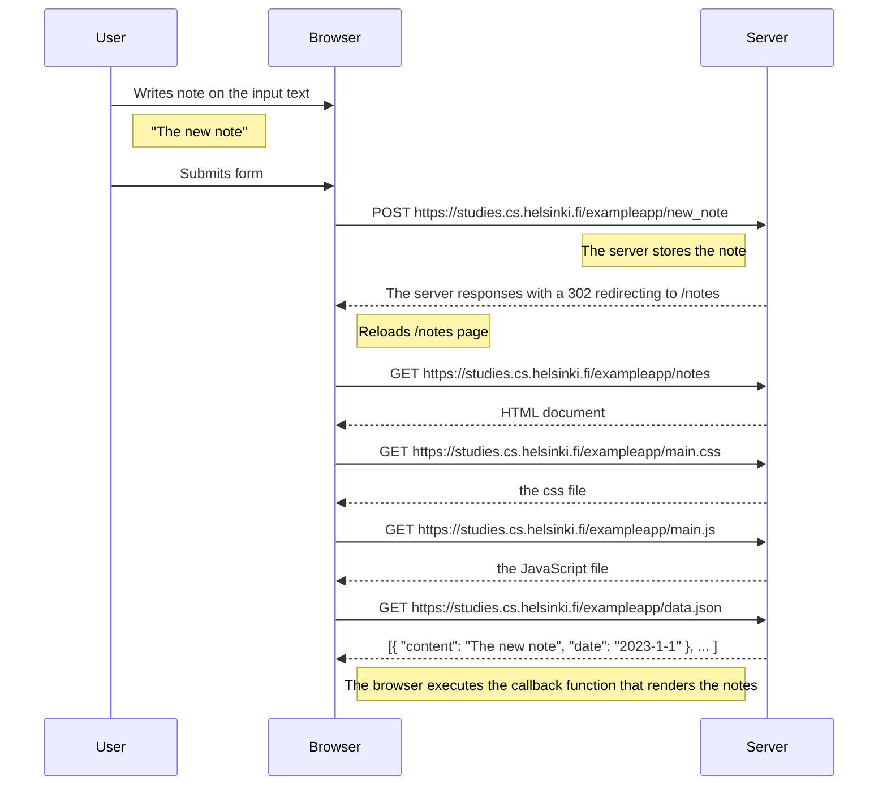

```mermaid
sequenceDiagram
participant User
participant Browser
participant Server

  User->>Browser: Writes note on the input text
  Note right of User: "The new note"
  User->>Browser: Submits form
  Browser->>Server: POST https://studies.cs.helsinki.fi/exampleapp/new_note
  Note left of Server: The server stores the note
  Server-->>Browser: The server responses with a 302 redirecting to /notes
  Note right of Browser: Reloads /notes page
  Browser->>Server: GET https://studies.cs.helsinki.fi/exampleapp/notes
  Server-->>Browser: HTML document
  Browser->>Server: GET https://studies.cs.helsinki.fi/exampleapp/main.css
  Server-->>Browser: the css file
  Browser->>Server: GET https://studies.cs.helsinki.fi/exampleapp/main.js
  Server-->>Browser: the JavaScript file
  Browser->>Server: GET https://studies.cs.helsinki.fi/exampleapp/data.json
  Server-->>Browser: [{ "content": "The new note", "date": "2023-1-1" }, ... ]
  Note right of Browser: The browser executes the callback function that renders the notes

```
