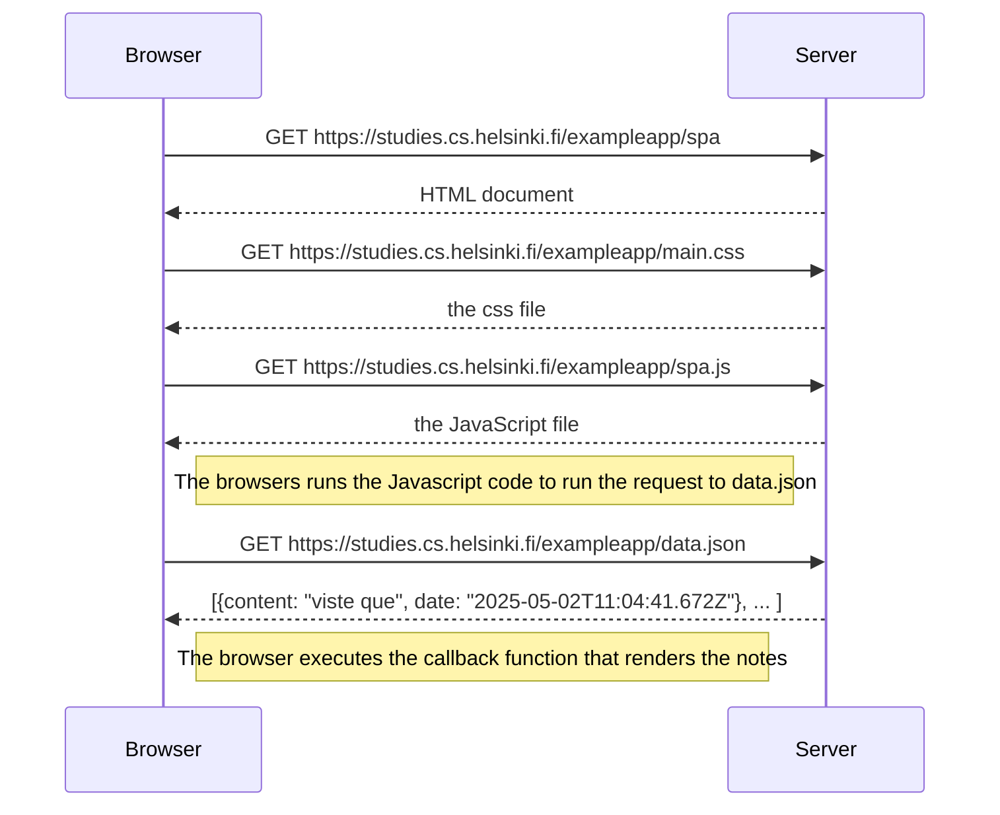

```mermaid
sequenceDiagram
participant Browser
participant Server

  Browser->>Server: GET https://studies.cs.helsinki.fi/exampleapp/spa
  Server-->>Browser: HTML document
  Browser->>Server: GET https://studies.cs.helsinki.fi/exampleapp/main.css
  Server-->>Browser: the css file
  Browser->>Server: GET https://studies.cs.helsinki.fi/exampleapp/spa.js
  Server-->>Browser: the JavaScript file
  Note right of Browser: The browsers runs the Javascript code to run the request to data.json
  Browser->>Server: GET https://studies.cs.helsinki.fi/exampleapp/data.json
  Server-->>Browser: [{content: "viste que", date: "2025-05-02T11:04:41.672Z"}, ... ]
  Note right of Browser: The browser executes the callback function that renders the notes
```
