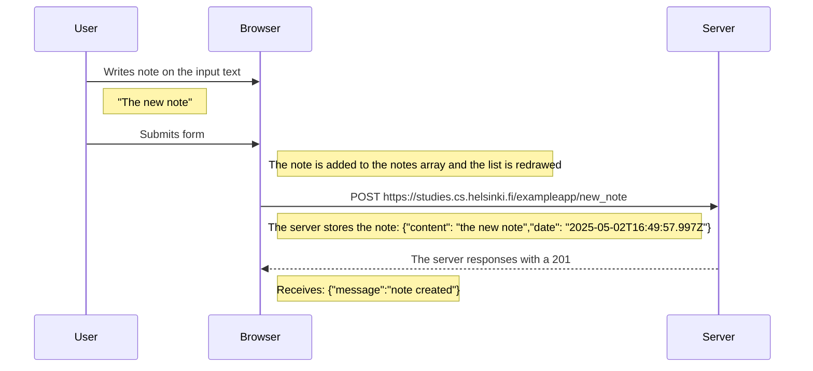

```mermaid
sequenceDiagram
participant User
participant Browser
participant Server

  User->>Browser: Writes note on the input text
  Note right of User: "The new note"
  User->>Browser: Submits form
  Note right of Browser: The note is added to the notes array and the list is redrawed
  Browser->>Server: POST https://studies.cs.helsinki.fi/exampleapp/new_note
  Note left of Server: The server stores the note: {"content": "the new note","date": "2025-05-02T16:49:57.997Z"}
  Server-->>Browser: The server responses with a 201
  Note right of Browser: Receives: {"message":"note created"}
```
